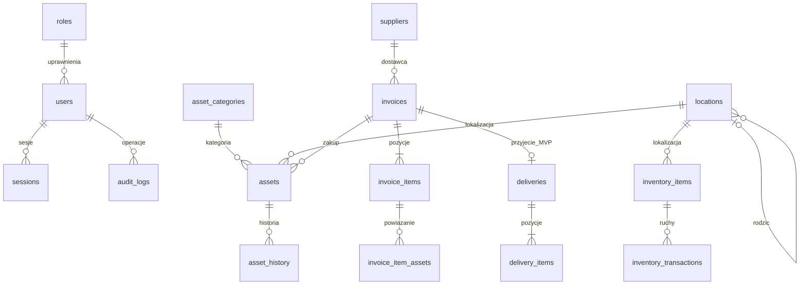

# Architektura IT Hardware

## Cel i granice systemu

System rozdziela fizyczne urządzenia (jeden rekord i Asset ID na sztukę) od produktów ilościowych (SKU, stan i ruchy). PostgreSQL jest jedynym źródłem prawdy. Stan nie jest przechowywany w plikach JSON ani statycznych rekordach UI. JSONB służy wyłącznie opcjonalnym polom kategorii, metadanym i migawkom audytu.

| Warstwa | Odpowiedzialność |
|---|---|
| `src/app/`, `src/components/` | Responsywne ekrany i formularze, prezentacja danych API |
| `src/app/api/[...path]/route.ts` | Routing HTTP, sesja, RBAC, CSRF, walidacja i odpowiedzi |
| `src/server/auth.ts`, `passwords.ts` | Konta, sesje, inicjalizacja, hasła i throttling |
| `src/server/services.ts` | Reguły biznesowe, parametryzowane repozytoria i transakcje |
| `src/server/validation.ts` | Walidacja wejścia Zod i ograniczenia domeny |
| `src/server/db.ts` | Pula połączeń i granice transakcji |
| `src/shared/types.ts` | Wspólne kontrakty API |
| `migrations/`, `scripts/` | Schemat, kontrolowane migracje i lokalne środowisko |

Next.js App Router i TypeScript pozwalają uruchomić UI oraz API na jednym własnym serwerze. Moduły serwera są niezależne od komponentów i mogą w przyszłości obsługiwać kolejkę, import lub odrębny backend.

Wybrano `pg` z typowanymi repozytoriami i parametryzowanym SQL jako odpowiednik warstwy persystencji. Model zawiera blokady rekordów, idempotencję, widoki rekurencyjne, indeksy trigramowe i historię chronioną triggerami. Bezpośredni SQL upraszcza te operacje i nie wymaga utrzymywania drugiego mapowania schematu ORM. Schemat oraz migracje pozostają czytelne dla administratora PostgreSQL. Wartości wejścia trafiają wyłącznie jako parametry `$1...`; fragmenty sortowania i filtrowania pochodzą z list dozwolonych kolumn.

## Główne relacje



Szczegóły każdego PK, FK, indeksu, typu i CHECK są zapisane w `migrations/001_initial.sql`. UUID identyfikuje rekord techniczny, a czytelny `ITHW-00000001` jest generowany sekwencją PostgreSQL i pozostaje unikalny. Numer seryjny, RFID i numer środka trwałego mają indeksy unikalne bez rozróżniania wielkości liter. Kwoty są `numeric(14,2)`, adresy sieciowe `inet/macaddr`, daty zakupu są `date`, a czasy operacji `timestamptz`.

Lokalizacje tworzą dowolne, acykliczne drzewo. FOLDER/SITE/BUILDING/ZONE/ROOM/RACK/SHELF/BIN/DESK opisują rodzaj węzła, bez wymuszania kolejności. Widok `location_paths` buduje ścieżkę, a `location_summary` liczy urządzenia w gałęzi. Kategorie mają graficzny edytor `field_definitions` i widoczności standardowych pól; urządzenia przechowują `custom_fields`.

## Transakcje i spójność

Pobranie/zwrot blokuje rekord produktu przez `SELECT ... FOR UPDATE`, sprawdza wynikowy stan, aktualizuje go i zapisuje ruch oraz audyt w tej samej transakcji. CHECK dodatkowo chroni zakres stanu. Idempotency request UUID + użytkownik + operacja + hash treści zapewnia, że retry po przerwanym połączeniu nie wykona drugiego pobrania. Ponowne użycie klucza z inną treścią zwraca konflikt.

Przyjęcie dostawy zapisuje fakturę, jej pozycje, dostawę, urządzenia lub przyrost stanu, powiązania oraz historię jako całość. Błąd dowolnej pozycji wycofuje całą operację. Dokument można też zapisać przed przyjęciem. Późniejsze częściowe przyjęcia produktów oraz nowych numerów seryjnych korzystają z jednej dostawy FV i aktualizują sumę jej przyjętych pozycji; każdy przyrost produktu ma oddzielny niezmienny ruch w historii. Blokady, wersja FV i requestId chronią pozostałą ilość oraz ponowienia. Powiązanie istniejącego urządzenia nie jest nowym przyjęciem. Ceny pozycji/kwota mogą być null, a uzupełnienie cen przyjętego dokumentu zachowuje stan i ceny na kartach sprzętu. Szczegóły migracji 014: [PURCHASE_ENTRY_PLAN.md](PURCHASE_ENTRY_PLAN.md).

Edycja urządzenia używa numeru `version`; użytkownik zapisujący nieaktualny formularz otrzymuje konflikt. Historii sprzętu, ruchów, audytu i wersji konfiguracji nie można aktualizować ani kasować zwykłą operacją SQL: blokują to triggery. Administrator infrastruktury z prawami właściciela bazy nadal może zmienić schemat, dlatego konta administracyjne i kopie zapasowe wymagają oddzielnej kontroli.

## Uprawnienia i bezpieczeństwo

| Rola | Odczyt | Pobranie/zwrot | Sprzęt i dostawy | Konta, słowniki, pełny audyt i eksport |
|---|---|---|---|---|
| VIEWER | Tak | Nie | Nie | Nie |
| IT_USER | Tak | Tak | Nie | Nie |
| IT_ADVANCED | Tak | Tak | Tak | Nie |
| ADMIN | Tak | Tak | Tak | Tak |

Autoryzacja jest egzekwowana po stronie API i w usługach zapisujących dane. Hasła są hashowane scrypt z indywidualną solą. Token sesji jest losowy i tylko jego SHA256 trafia do bazy; cookie jest HttpOnly, SameSite=Strict i Secure w produkcji, a sesja wygasa po 12 godzinach. Zmiana roli/aktywności unieważnia sesje konta. Ostatni aktywny administrator nie może zostać zdegradowany.

Zapisy wymagają zgodnego Origin z `APP_URL` i tokenu CSRF sesji. Żądania JSON są ograniczone do 128 KiB także przy braku nagłówka Content-Length. Zod i ograniczenia bazy sprawdzają dane. Logowanie i inicjalizacja mają limit prób w PostgreSQL, wspólny dla procesów aplikacji. React koduje zwykły tekst. Nagłówki blokują osadzanie w ramkach i sniffing MIME. Obecna CSP zezwala na skrypty inline potrzebne do bootstrappingu Next.js; przejście na nonce z pełną restrykcyjną polityką CSP stanowi zadanie przed docelowym audytem bezpieczeństwa.

Pierwsze konto tworzy wyłącznie osoba posiadająca `SETUP_TOKEN` minimum 32 znaki albo administrator lokalnego terminala. Operacja sprawdza pustą tabelę kont pod blokadą transakcyjną. Nie istnieje domyślny login, hasło ani zapisane dane produkcyjne.

## Konto bazy aplikacji

W produkcji konto aplikacji nie może być właścicielem schematu ani superuserem. Konto migracji jest odrębne; `MIGRATION_DATABASE_URL` jest używane tylko przez narzędzia. Po zastosowaniu migracji administrator infrastruktury może wykonać w sesji psql na właściwej bazie:

```sql
CREATE ROLE ithardware_app LOGIN NOSUPERUSER NOCREATEDB NOCREATEROLE NOREPLICATION;
-- W psql użyj \password ithardware_app; nie zapisuj hasła w pliku SQL.
REVOKE CREATE ON SCHEMA public FROM PUBLIC;
GRANT USAGE ON SCHEMA public TO ithardware_app;
GRANT SELECT, INSERT, UPDATE, DELETE ON ALL TABLES IN SCHEMA public TO ithardware_app;
GRANT USAGE, SELECT ON ALL SEQUENCES IN SCHEMA public TO ithardware_app;
REVOKE UPDATE, DELETE, TRUNCATE ON asset_history, inventory_transactions,
  audit_logs, configuration_versions, equipment_documents, inventory_scan_events FROM ithardware_app;
REVOKE ALL ON schema_migrations FROM ithardware_app;
REVOKE INSERT, UPDATE, DELETE, TRUNCATE ON roles, asset_statuses FROM ithardware_app;
```

Ustaw `DATABASE_URL` na to konto. Przy kolejnych migracjach przyznawaj uprawnienia do nowych obiektów jawnie; nie dawaj kontu aplikacji DDL/TRUNCATE ani prawa wyłączania triggerów. Podstawowy Docker POSTGRES_USER jest kontem infrastruktury, bo oficjalny obraz tworzy je jako superuser ([dokumentacja obrazu](https://hub.docker.com/_/postgres)). Lokalny wbudowany PostgreSQL używa własnego konta do rozwoju; nie jest wzorcem konfiguracji produkcyjnej.

## Wyszukiwanie i wzrost systemu

Listy mają paginację po stronie serwera, limity długości wyszukiwania i indeksy na FK, statusach, datach oraz złożonych polach tekstowych `pg_trgm`. Nie pobierają całego magazynu do przeglądarki. Dla dziesiątek tysięcy rekordów należy zmierzyć rzeczywiste zapytania przez EXPLAIN ANALYZE, rozbudować indeksy zgodnie z używanymi filtrami i rozważyć paginację kursorem przy głębokich stronach. Nie wykonano jeszcze testu obciążenia na danych firmy ani walidacji pod konkretny SLA.

Połączenia w procesie aplikacji są ograniczone pulą 10; dodatkowe repliki wymagają obliczenia całkowitego limitu połączeń, monitoringu i ewentualnie PgBouncer. Dostawy i zmiany stanów nie zależą od pamięci jednego procesu.

## Punkty rozszerzeń

- **Pliki i konfiguracje:** upload PDF do 10 MB i tekstu UTF-8 do 256 KiB, kontrola formatu, rozszerzenia/nazwy, SHA256, idempotencja i autoryzowane pobieranie. Bajty są w PostgreSQL, poza katalogiem publicznym. Konfiguracje mają niezmienne wersje z autorem i historią zastosowania na urządzeniu. Nie ma wysyłania konfiguracji do urządzenia ani silnika antywirusowego.
- **RFID i inwentaryzacja:** `assets.rfid_tag` identyfikuje sprzęt; wejście HID i QR zapisuje historię. `inventory_scans`, `inventory_scan_items` i niezmienne `inventory_scan_events` obsługują snapshot lokalizacji i zamknięty raport. Adapter protokołu konkretnego czytnika pozostaje zależny od wyboru urządzenia.
- **QR:** kody kierują do kanonicznego `APP_URL`; generowanie SVG jest deterministyczne i nie wymaga zapisu obrazu. `qr_codes` umożliwia późniejsze rejestrowanie serii wydruków i etykiet.
- **SSO:** `users.external_identity` i nullable `password_hash` przewidują zewnętrzną tożsamość. Microsoft Entra ID wymaga rejestracji aplikacji i mapowania ról; nie jest podłączony.
- **ServiceNow:** zatwierdzony URL HTTPS można zapisać w wersjonowanych ustawieniach; początkowy fallback to `SERVICENOW_URL`. Moduł `incidents` jest lokalnym rejestrem zgłoszeń z opcjonalną referencją zewnętrzną, bez synchronizacji API.
- **Raportowanie i import:** CSV według uprawnień, raporty i kontrolowany import Excel/CSV są wdrożone. Eksport XLSX, Power BI i odrębne konto raportowe wymagają dalszej konfiguracji.

Dalszy rozwój powinien rozszerzać te granice po uzyskaniu rzeczywistych danych i interfejsów, zachowując transakcyjny rdzeń i ciągłość historii.

## Moduły przebudowy produktu

Migracje 009/010 rozszerzają istniejący schemat, bez destrukcyjnego zastępowania tabel.

- `permissions.ts`: guard endpointów, granularne permissions, role dodatkowe, przypisania i hashowane jednorazowe zaproszenia. Role bazowe nadal ograniczają dostęp do krytycznej administracji. Zmiana profilu/roli odwołuje sesje.
- `library.ts`: pliki PDF/UTF-8 oraz niezmienne wersje konfiguracji; scopes pobrania uniemożliwiają obejście dostępu do FV lub konfiguracji przez bibliotekę ogólną.
- `stocktakes.ts`: snapshot oczekiwanego sprzętu, blokada sesji podczas skanu/finish, zdarzenia niezmienne, idempotencja, raport końcowy przechowywany jako zamrożona migawka. Odpowiedź po skanie zawiera tylko zdarzenie i podsumowanie.
- `product-operations.ts`: lokalne zgłoszenia, wspólne liczniki, szczegóły gałęzi, wersjonowane ustawienia i operacje masowe z blokadami w deterministycznej kolejności. Błąd jednej wersji wycofuje całość.
- `search.ts`: indeksy GIN/trigram oraz ograniczone zbiory kandydatów przed kosztownym rankingiem. Wyszukiwanie uwzględnia uprawnienia typów wyników; dokładne Asset ID ma najwyższy priorytet.
- `scans.ts`: odczyty identyfikatorów zapisują zdarzenia historii, nie zmieniając wersji danych sprzętu.
- `equipment-documents.ts`: osobisty stan pracownika jest oddzielny od wyposażenia gałęzi DESK; niezmienna migawka dokumentu nie zmienia właściciela urządzenia.

Frontend współdzieli zasób operations między nagłówkiem a dashboardem, paginuje ewidencję po stronie serwera i przechowuje wyłącznie preferencje widoków lokalnie. Kolejka identyfikatorów serializuje zapis, zachowuje nieudany odczyt do retry i ogranicza pojemność. Drzewo korzysta z mapy dzieci i zapamiętanego zbioru potomków podczas przeciągania. Preview oraz menu kontekstowe są portalami poza transformacją strony.

Zmierzone wyniki 10 000 syntetycznych urządzeń: [PERFORMANCE_RESULTS.json](PERFORMANCE_RESULTS.json). Nie potwierdzają SLA produkcji ani obciążenia wielu użytkowników.


## Ilości ułamkowe i terminale — 08.10.2026

Migracja 015 przechowuje stany, minima, ilości dokumentów i ruchów jako `numeric(13,3)`. Jednostka ma precyzję 0–3; faktura zachowuje jej snapshot. Triggery oraz API kontrolują precyzję; używanej jednostki nie można usunąć, przemianować symbolu ani obniżyć precyzji. Obliczenia TypeScript używają całych tysięcznych (`bigint`), a pieniądze całych groszy z zaokrągleniem każdej pozycji. Projekcje ilości jawnie konwertują SQL numeric do liczby; parser kwot nadal zwraca tekst. Blokady produktów chronią odczyt jednostki podczas tworzenia/edycji faktury i operacji stanu.

Konfiguracja terminala zawiera wybór pól, liczników i prezentacji. `device-terminal.ts` tworzy ograniczone read modele: terminal nie otrzymuje ukrytych pól ani pełnego snapshotu spisu. Kolejka zamraża tryb i ID spisu przy odczycie, a konflikt konfiguracji wymaga aktualizacji lub jawnego odrzucenia przy zmianie celu. Zmiana konfiguracji czyści stare wyniki widoku i zatrzymuje aparat po jego wyłączeniu.
