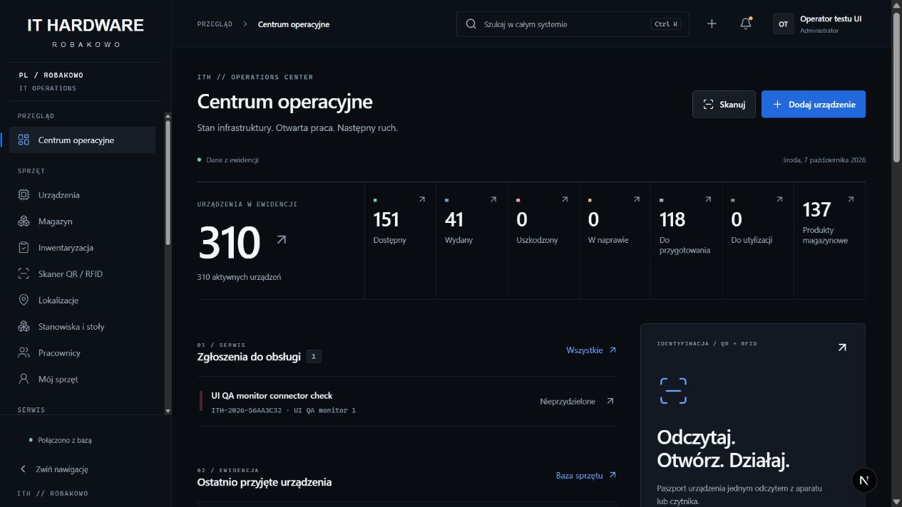
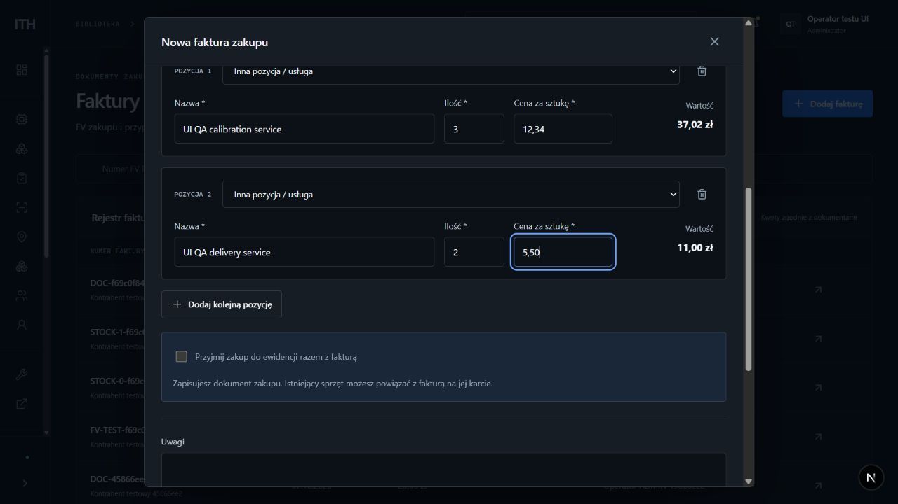
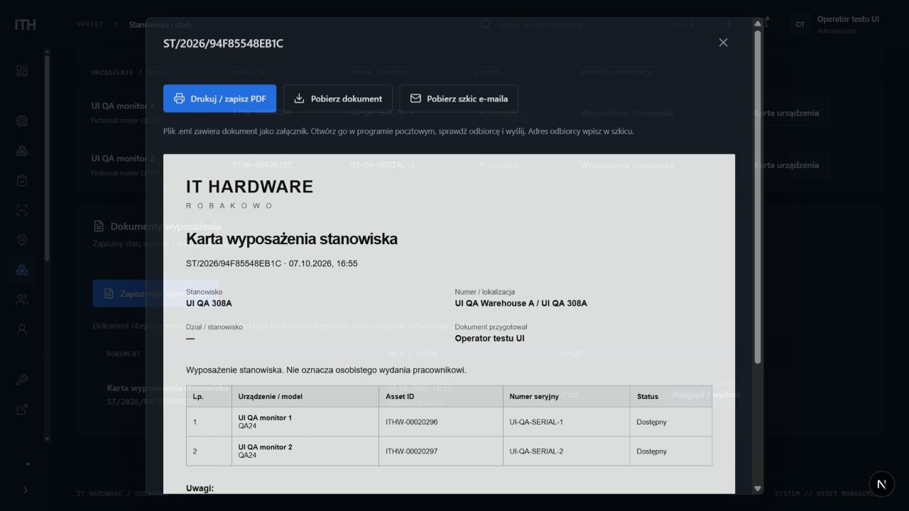
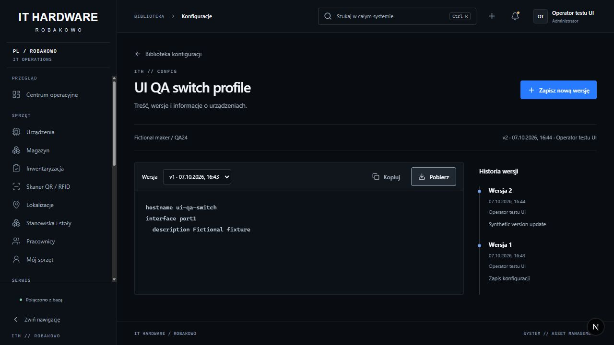
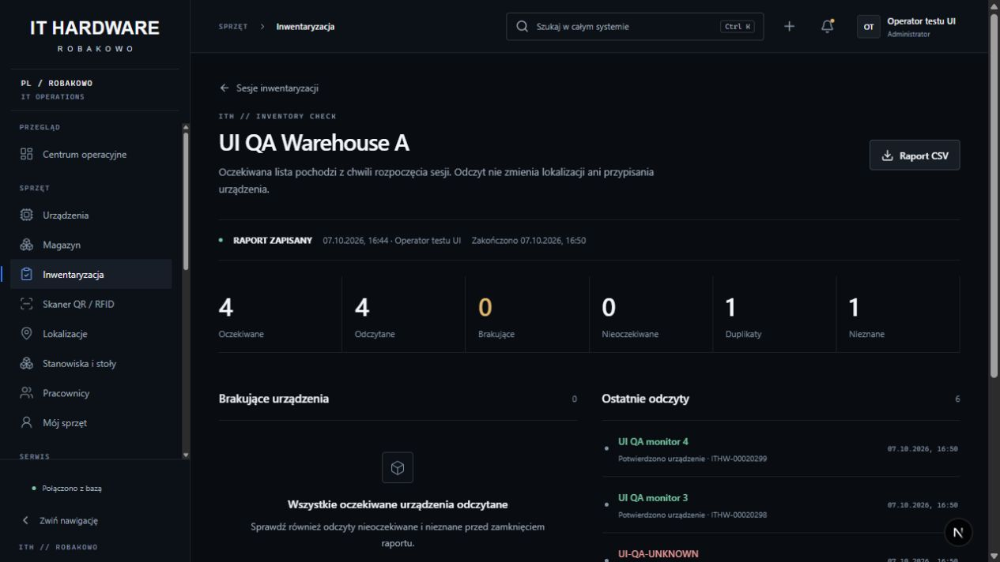
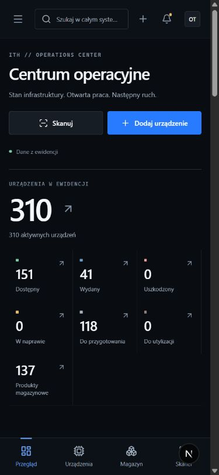

# IT HARDWARE ROBAKOWO — wynik przebudowy

Wdrożono bezpośrednio w istniejącym projekcie, 7 października 2026. Aplikacja lokalna działa pod http://localhost:3000. Dane firmowe nie były przeglądane; testy i poniższe obrazy wykorzystują wyłącznie oddzielną bazę `_test`.

## 🟢 COMPLETED

### Branding, dashboard, menu i motion

Zachowano typograficzne logo IT HARDWARE / rozstrzelone ROBAKOWO. Interfejs ma solidne grafitowe powierzchnie, techniczne oznaczenia, monospace dla identyfikatorów i wspólne komponenty. Dashboard łączy główny licznik sprzętu, płaski pasek statusów, listę zgłoszeń, tabelę ostatnich urządzeń, historię, skaner i braki magazynowe. Liczniki i skróty prowadzą do odpowiednich filtrów; informacje pochodzą z bazy i uwzględniają uprawnienia.

Menu obejmuje Przegląd, Sprzęt, Serwis, Bibliotekę i Administrację. Można je zwinąć do ikon; na telefonie działa jako zamykany panel. Header zawiera wyszukiwanie, szybkie akcje, rzeczywiste alerty operacyjne i profil. Dodano menu kontekstowe, skeletony, ponowienie pobierania i krótkie komunikaty sukcesu. Mikrointerakcje trwają 140 ms, wejście strony 260 ms, intro logo 1100 ms raz na sesję. Reduced motion ogranicza efekty. Nie dodano biblioteki animacji ani zdalnych fontów.

Tokeny: tło `#090D12`, panel `#11161D`, powierzchnia podniesiona `#171D25`, tekst `#F5F7FA`, pomocniczy `#A0ADBC`, etykiety `#8595A7`, akcent `#287BFF`, tekst akcentu `#6CA5FF`, przycisk `#2169DD`. Promienie 4–6 px. Kontrast tekstów na podniesionej powierzchni: 15,79 / 7,42 / 5,53:1; biały tekst przycisku 5,09:1. To pomiary tokenów, nie pełny audyt WCAG.

### Search i lokalizacje

Ctrl+K / Cmd+K oraz `/` otwierają wyszukiwanie, `>` pokazuje polecenia. Działają strzałki, Enter, Escape, ostatnie zapytania, anulowanie nieaktualnych żądań i debounce 120 ms. Wyniki obejmują urządzenia (Asset ID, SN, RFID, QR, MAC, IP, model i producent), pracowników, konta, lokalizacje, magazyn, faktury, zgłoszenia, konfiguracje i dokumenty. Backend stosuje ranking, dopasowania częściowe i trigramowe oraz filtruje rodzaje wyników według uprawnień.

Offset przeciągania wynikał z pozycjonowania preview wewnątrz przekształconego kontenera strony. Preview przeniesiono portalem do `document.body`; używa `position:fixed` oraz `clientX/clientY`, z 12 px odstępem od kursora, bez korekty zależnej od szerokości menu. Uchwyt utrzymuje pointer capture, źródło przygasa, cel jest podświetlany, zamknięta gałąź rozwija się po 550 ms, Escape anuluje, a upuszczenie zapisuje zmianę z kontrolą wersji. Cykl i przeniesienie do siebie są blokowane. Indeks dzieci i zbiór potomków są przygotowywane raz zamiast ponownie przeszukiwać całe drzewo przy każdym ruchu wskaźnika.

Panel lokalizacji pokazuje dzieci, liczbę urządzeń, sprzęt i ostatnie ruchy. Działa tworzenie podfolderów, edycja, przenoszenie także przez wybór rodzica z klawiatury, QR i usuwanie pustych folderów zgodnie z uprawnieniami.

### Brakujące funkcje

- Paszport urządzenia: identyfikatory, sieć, zakup/FV, gwarancja, przypisanie, pliki, wersje konfiguracji, zgłoszenia i historia. Tabela ma filtry, sortowanie, wybór kolumn, zapis widoku i paginację. Operacje masowe obejmują przeniesienie, status, przypisanie, CSV i etykiety; zapis jest atomowy, do 100 urządzeń.
- Faktury: czytelny formularz pozycji typu sprzęt / magazyn / inne, ilość, cena jednostkowa, suma i numery seryjne. Kwoty obsługują polski przecinek i dokładne grosze. Można zapisać samą FV lub atomowo przyjąć zakup. Działają PDF, edycja z wersją i powiązanie istniejącego sprzętu.
- Pracownicy i stoły: oddzielne przypisania osobiste oraz stanowiska DESK, np. 308A. Sprzęt stojący na stole nie trafia automatycznie na pracownika. Zapisane karty wyposażenia, rozpiski stanowiska i obiegówki mają niezmienną migawkę, numery seryjne i miejsca na podpisy; są dostępne do wydruku oraz jako szkic wiadomości `.eml`.
- Konfiguracje: zapis i wyszukiwanie, model/producent/typ urządzenia, autor, niezmienne wersje, kopia tekstu, pobieranie oraz rejestracja zastosowanej wersji na urządzeniu. Rejestracja nie wysyła konfiguracji do sprzętu.
- Dokumenty: autoryzowany upload/pobieranie PDF i tekstu, powiązanie z urządzeniem, archiwum papierowych dokumentów wyposażenia oraz wyszukiwanie. Zawartość jest w PostgreSQL i w jego backupie.
- Inwentaryzacja: wybór lokalizacji, migawka oczekiwanego sprzętu, kolejka odczytów, oczekiwane/brakujące/nadmiarowe/duplikaty/nieznane, zamknięcie i niezmienny raport z CSV. Retry nie zapisuje zdarzenia dwa razy.
- Skaner: pojedynczy i ciągły odczyt HID, identyfikacja wielu urządzeń, QR z obrazu i bezpośrednie otwarcie paszportu. Historia zapisuje odczyty RFID/QR.
- Serwis: rzeczywisty lokalny rejestr zgłoszeń, operator, priorytet, status, urządzenie, historia i referencja zewnętrzna. ServiceNow pozostaje jawnym linkiem do portalu; liczniki lokalnych zgłoszeń nie udają synchronizacji.
- Konta i RBAC: aktywacja/dezaktywacja, ostatnie logowanie, role bazowe, własne profile uprawnień, macierz, przypisanie profilu, jednorazowe zaproszenie ważne 7 dni i unieważnianie sesji przy zmianie dostępu. Backend kontroluje także pola zapisu, eksporty, skanowanie, powiązane dane i pobieranie plików. Profil dodatkowy może ograniczać rolę bazową.
- Audyt: istotne operacje zapisują autora, czas, obiekt oraz stan przed/po; treść konfiguracji i sekrety nie są zapisywane w audycie.

### Naprawy i bezpieczeństwo danych

Przed migracjami wykonano spójną kopię zatrzymanego lokalnego klastra PostgreSQL poza OneDrive, z manifestem SHA256. Migracje `009_product_rebuild.sql` i `010_search_indexes.sql` zastosowano w bazie testowej i aplikacyjnej; nie usuwano danych ani nie edytowano wcześniej zastosowanych migracji.

Naprawiono porównanie UUID/tekstu w historii lokalizacji, typowanie parametrów przy akceptacji zaproszenia, kontrolę uprawnień starszego endpointu identyfikacji, ujawnianie danych przez powiązane ekrany oraz koszt rankingu wyszukiwarki. Kolejka skanów używa świeżego stanu i małą odpowiedź po odczycie zamiast pobierać pełną migawkę sesji za każdym razem. Pola formularzy mają jednoznaczne dostępne nazwy.

Audyt objął kod, README, API, schemat i migracje. Wyszukiwanie TODO/FIXME/tymczasowych ekranów nie wykazało pozostawionych atrap modułów. Katalog nie ma repozytorium Git ani skonfigurowanego zdalnego repozytorium, więc Issues/PR nie były dostępne.

## Weryfikacja

- **14/14 testów jednostkowych, 45/45 integracyjnych**, bez pominięć; końcowy build produkcyjny Next.js wraz z TypeScript poprawny.
- API/PostgreSQL: login, sesje, CSRF, RBAC, urządzenia, wydanie/zwrot/przekazanie, atomowe dostawy i FV, PDF, konflikty wersji, równoczesne zapisy, rollback/idempotencja, niemodyfikowalna historia, konfiguracje, dokumenty, inwentaryzacja, bulk, incydenty, zaproszenia i ustawienia.
- Przeglądarka na fikcyjnej bazie: wyszukiwanie IP klawiaturą i otwarcie paszportu; zapis dwóch wersji konfiguracji i pobranie starszej; sześć skanów i zamknięcie raportu; natywne przeniesienie folderu; sortowanie i zapis widoku; masowe przeniesienie dwóch monitorów na stół bez przypisania pracownika; zapis i podgląd rozpiski; FV z dwiema pozycjami i sumą 48,02 PLN; zapis zgłoszenia; odczyt ciągły oraz QR z PNG.
- Dashboard: 2560×1440, 1920×1080, 1366×768, 768×1024, 390×844 bez przepełnienia dokumentu. Na telefonie sprawdzono także urządzenia, faktury, konfiguracje, lokalizacje, macierz i sesję inwentaryzacji. Tabele przewijają się we własnym obszarze.
- Benchmark **10 000 fikcyjnych urządzeń**, 12 próbek: p95 wyszukiwania 78–149 ms, strony 25 urządzeń 29 ms. Pomiar funkcji serwera i PostgreSQL, bez sieci, przeglądarki, uwierzytelnienia i obciążenia wielu użytkowników. Wyniki: [PERFORMANCE_RESULTS.json](PERFORMANCE_RESULTS.json).

## 🟡 MANUAL CHECK

- Fizyczny czytnik QR/RFID, aparat telefonu oraz wydruk/kalibracja etykiet Zebra 300 DPI. Odczyt tekstowy/HID i QR z PNG zostały zweryfikowane.
- Wydruk kart/obiegówek na docelowym papierze, podpisy i otwarcie szkicu `.eml` w firmowym kliencie poczty. Aplikacja nie wysyła maili samodzielnie.
- Osobny test odtworzenia backupu, docelowe HTTPS i sesje Secure, produkcyjny serwer oraz równoczesne obciążenie. Nie wykonywano testu na firmowych rekordach.
- Pełny audyt czytnika ekranu i wariantów skalowania Windows/browser zoom. Drag/drop zweryfikowano natywnym wskaźnikiem przy DPR 1,5; nie zmierzono wszystkich fizycznych konfiguracji ekranów.
- Otwarcie firmowego ServiceNow przez użytkownika z firmowym SSO.

## 🔴 BLOCKED

Nie ma blokera dla lokalnego zakresu przebudowy. Automatyczna poczta, synchronizacja API ServiceNow oraz adapter dedykowanego czytnika wymagają danych środowiska/urządzenia i dostępu; nie przedstawiono ich jako gotowych integracji. Obecne funkcje to szkic wiadomości, portal ServiceNow i wejście HID/QR zgodne z ustalonym zakresem.

## Status końcowy

| Obszar | Status |
| --- | --- |
| BRANDING | 🟢 |
| UI/UX | 🟢 |
| MENU | 🟢 |
| SEARCH | 🟢 |
| LOCATION TREE | 🟢 |
| RFID/QR | 🟡 — fizyczny czytnik, aparat i drukarka wymagają próby |
| ASSET MANAGEMENT | 🟢 |
| RBAC | 🟢 |
| FUNCTIONALITY | 🟢 — zweryfikowany zakres lokalny, z jawnymi granicami integracji |
| PERFORMANCE | 🟢 — benchmark syntetyczny; produkcyjne obciążenie niezmierzone |
| RESPONSIVE | 🟢 |

## Podglądy — wyłącznie fikcyjne dane

